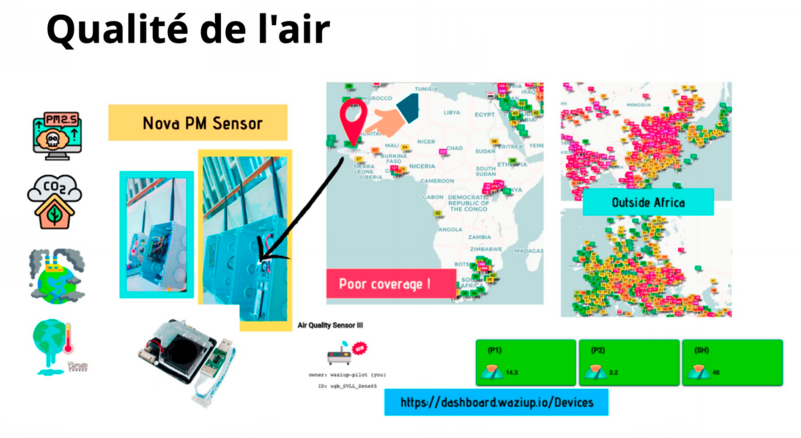
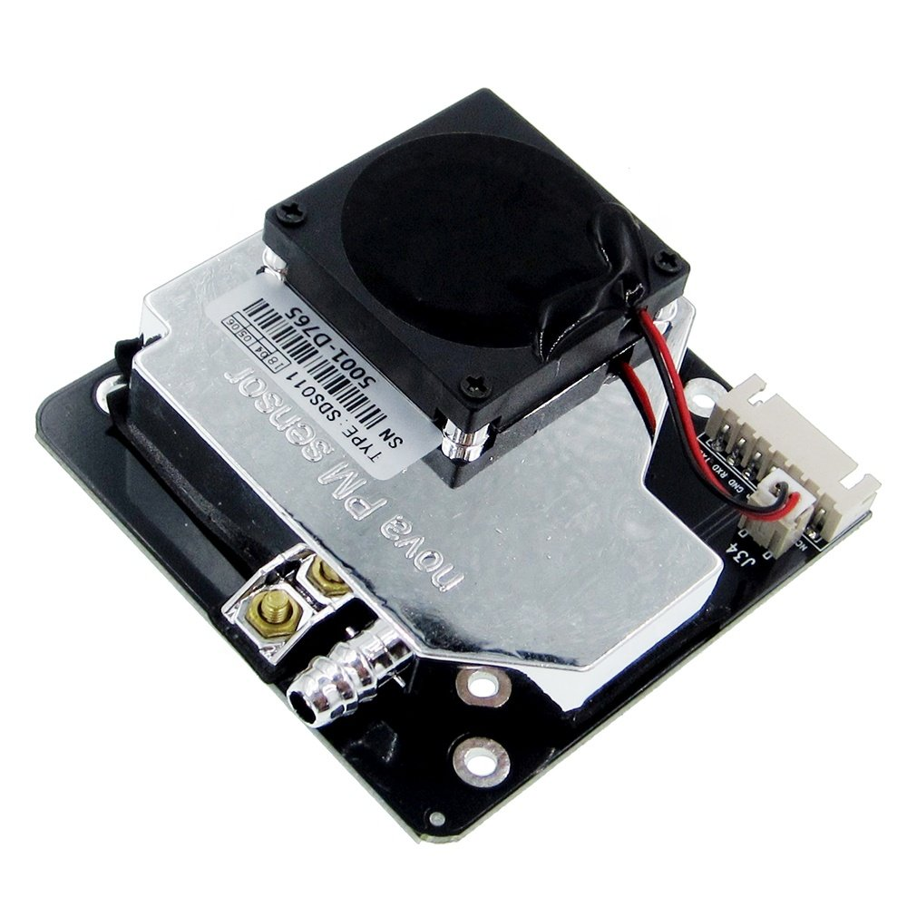

# Open data
## Air quality

Air quality is one of the MVP supported by the Smart village Living Lab in Saint-Louis. This is part of the environmental data collection program initiated together with scientific partners working on climatic change and control. 

  

These data are extracted from different sensors deployed outside UGB. The referenced sensors are pictured below.

  
  

## Data coverage
Date from: 20-01-01\
Date to: 21-03-02

## Parameters
Below are the supported parameters :
- \>=0.3um/dl
- \>=0.5um/dl
- \>1.0um/dl
- \>=2.5um/dl
- \>=5.0um/dl
- \>=10.0um/dl
- PM1.0_ATM_ug/m3
- PM10_ATM_ug/m3
- PM1.0_CF1_ug/m3
- PM2.5_CF1_ug/m3
- PM10.0_CF1_ug/m3
- RSSI_dbm
- Temperature_F
- Humidity_%
- PM2.5_ATM_ug/m3
- ADC
- Pressure_hpa
- IAQ

These data has been published under the Open data initiative from the Smart Village Living Lab, in the context of the Wazihub project (www.wazihub.com), partenered with Sonatel, Orange, and University Gaston Berger of Saint-Louis.
