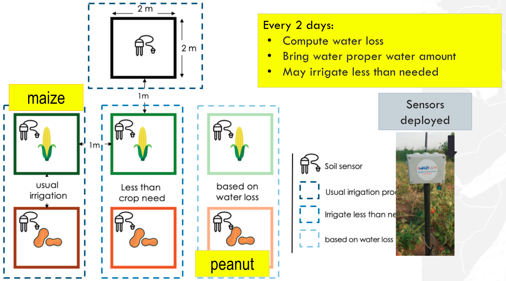

# Weather data

This dataset was collected as part of an experiment conducted by Wazihub using low-cost internet of things (IoT) sensors over 4 months in 4 fields growing maize and peanuts in Senegal.

  

An IoT sensor was placed in four distinct plots of land that were planted with either maize or peanuts (the same amount of maize is sown in each maize plot, and the same for peanuts). Plots are right next to each other, separated by a one meter perimeter.

## Irrigation schedule
There are three types of irrigation schedules:
- Usual irrigation: water every two days
- Less than crop needs: water less than every two days, i.e. the crops were irrigated in irregular intervals, giving the crops less than what was needed.
- Based on water loss: Water given based on estimate water loss. Estimated water loss was calculated using different parameters including evapotranspiration and soil moisture level collected from the IoT sensors.
 
The fields were irrigated and growing crops as follows:

- Field 1: Maize, less water irrigation
- Field 2: Peanuts, irrigation based on water loss
- Field 3: Peanuts, less water irrigation
- Field 4: Peanuts, normal irrigation

## Parameters
The IoT soil moisture sensors were set up in each of the fields and an IoT weather station was set up near the fields. These IoT devices transmitted the following data in five minute intervals:
- Soil humidity
- Air temperature (C)
- Air humidity (%)
- Pressure (KPa)
- Wind speed (Km/h)
- Wind gust (Km/h)
- Wind direction (Deg)

We have also included an “irrigation” variables associated with each of the four field. The irrigation variable is set to 1 when the irrigation is turned on and the soil moisture is rising and set to 0 when the irrigation is turned off.

Other context data was collected by hand on a daily basis (but recorded for the previous day):

- Min temperature min (°C) j-1: Minimum daily temperature measured in celsius
- Max temperature (°C) j-1: Maximum daily temperature measured in celsius
- Relative humidity (%) j-1: Percent air humidity
- Wind speed (m/s) j-1: Wind speed measured in meters per second
- Solar Irradiance (W/M²) j-1: The power per unit area (Watt per square metre, W/m2), received from the Sun in the form of electromagnetic radiation as reported in the wavelength range of the measuring instrument.
- Sun (Mj/jour) j-1: Radiant energy emitted by the sun measured in Mega Jouls per day
- Coefficient cultural (Kc) j-1: Crop coefficient Kc. A property of plants used in predicting evapotranspiration (ET). Evapotranspiration is the process by which water is transferred from the land to the atmosphere through evaporation and plant transpiration. Kc is the most basic crop coefficient calculated as ETc / ETo
- Evapotranspiration measured (ETc) j-1: The evapotranspiration rate observed in the crop being studied.
- Evapotranspiration reference (ETo) j-1: The evapotranspiration rate observed for a well calibrated reference crop under the same conditions
- Rainfall per day
- Water need 100% BE / 1j: The water needs of the crop measured (Evapotranspiration (ETc) - Rainfall) times 4 aggregated every day.
- Water need 100% BE / 2j: The water needs of the crop measured (Evapotranspiration (ETc) - Rainfall) times 4 aggregated every two days.
- Water need 100% BE / 3j: The water needs of the crop measured (Evapotranspiration (ETc) - Rainfall) times 4 aggregated every three days.

## Files to download
The files you have for download here are:
- Train.csv - contains the soil humidities for 4 fields and the other variables that are collected every five minutes by the IoT weather station. The last four days for soil humidities in fields 1 and 3 and the last six days for soil humidities in fields 2 and 4 have been removed as the test set. However, where the soil humidity peaks due to irrigation within the testset, you are provided with the peak soil humidity.
- Context_data_maize.csv - Context data collected by hand in Excel.
- Context_data_peanut.csv - Context data collected by hand in Excel.
- Variable_Definitions.csv - Definitions of variables
